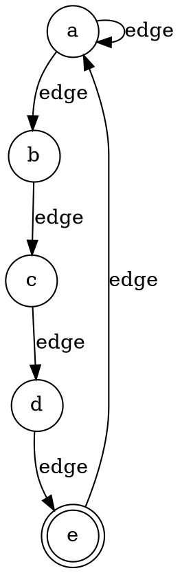

```dot
digraph G {
    // Set default node style
    node [shape=circle, style=filled, color=black, fillcolor=white];

    // Define nodes
    a;
    b;
    c;
    d;
    e [shape=doublecircle]; // Node "e" as double circle

    // Define edges with labels
    a -> b [label="edge"];
    b -> c [label="edge"];
    c -> d [label="edge"];
    d -> e [label="edge"];
    e -> a [label="edge"];

    // Self-loop on "a"
    a -> a [label="edge"];
}

```

