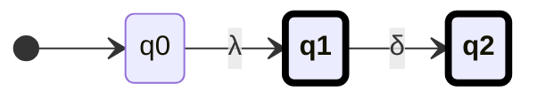
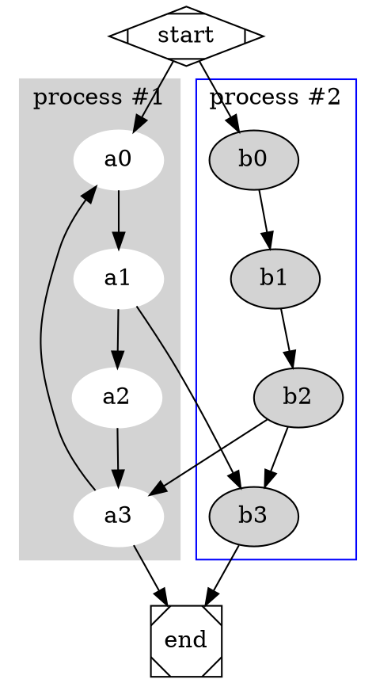

```mehrmaid
```
```mehrmaid

```

```mehrmaid
flowchart LR

A --> C
B --> D
C & D --> E
E --> F & G
F --> H
G --> J
A -.->|"$Σ^{*}$"|A
A-->|text|B


A((("$A$")))
G(("$G$"))
E(("$E$"))
C(("$C$"))
D(("$D$"))
F(("$F$"))
B(("$B$"))
H(("$H$"))
J(("$J$"))

```


