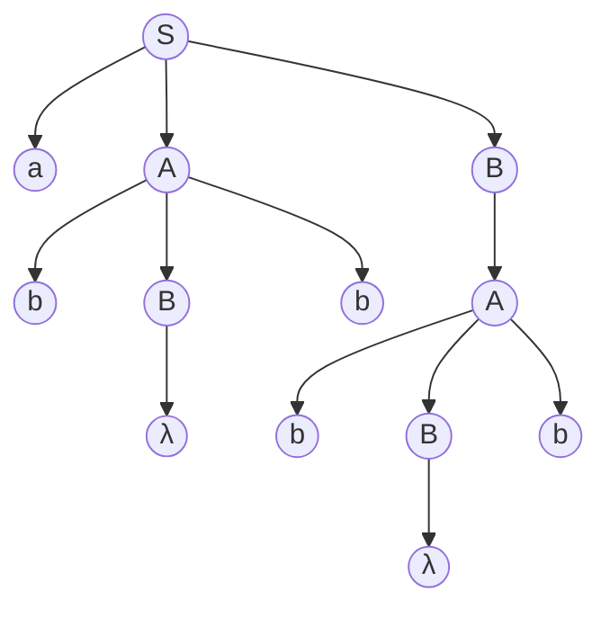
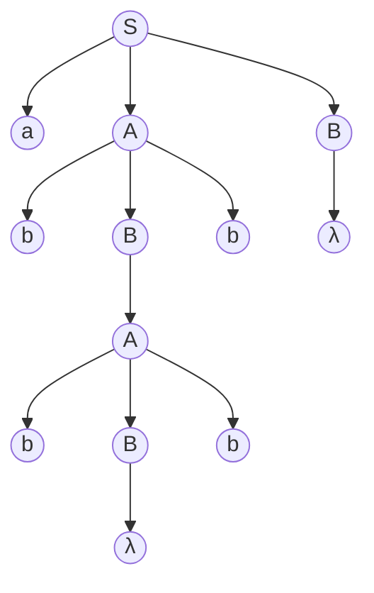

# Reduction of the Number of States in Finite Automata
# Reduction of the Number of States in Finite Automata & Regular Expressions
# Regular Expressions & Connection Between Regular Expressions and Regular Languages
# Connection Between Regular Expressions and Regular Languages
# Regular Grammars
# Closure Properties of Regular Languages
# Closure Properties of Regular Languages and Elementary Questions about Regular Languages
# Identifying Nonregular Languages

$L = \{a^{n}b^{n}:n\ge 0\}$
- $a^{m}b^{m}$
	- $|y| = k$ 일 때, $a^{m-k}b^{m}$ 역시 $L$에 포함되어야 한다.
	- 그러나 $a^{m-k}b^{m} ∉ L$, 따라서 가정은 모순이다.
	- $L$ is not regular.
$L = \{ww^{R}:w ∈ Σ^{*}\}$
- $a^{m}b^{m}b^{m}a^{m}$
	- $|y| = k$ 일 때, $a^{m-k}b^{m}b^{m}a^{m}$ 역시 $L$에 포함되어야 한다.
	- 그러나 $a^{m-k}b^{m}b^{m}a^{m} ∉ L$, 따라서 가정은 모순이다.
	- $L$ is not regular.
$L = \{w ∈ Σ^{*}: n_{a}(w)<n_{b}(w)\}$
- $a^{m}b^{m+1}$
	-  $|y| = k$ 일 때, $a^{m+k}b^{m+1}$ 역시 $L$에 포함되어야 한다.
	- $m+k \ge m+1$
		- 따라서 가정은 모순이다.
	- $L$ is not regular
$L = \{(ab)^{n}a^{k}:n>k, k \ge 0\}$
- $(ab)^{m+1}a^{m}$
	- $|y| = k$ 일 때, $(ab)^{m+1-k}a^{m}$ 역시 $L$에 포함되어야 한다.
		- $y$에 $b$가 포함된 경우 - 모순
		- $y$에 $b$가 포함되지 않은 경우 - 패턴 생성 불가능, 모순
	- $L$ is not regular

> pumping lemma를 적용하는 위치는 반드시 string의 앞일 필요는 없다.
> string의 중간, 끝에서도 사용할 수 있다.

$L = \{a^{n^{2}}: n \ge 0\}$
- $a^{m^{2}}$
	- $|y| = k \le m$일 때, $a^{m^{2}}+k$ 역시 $L$에 포함되어야 한다.
		-  $a^{m^{2}}+k \ne a^{(m+1)^2}$
	- 이는 불가능하므로, 가정은 모순이다.
	- $L$ is not regular

$L = \{a^{n}b^{k}c^{n+k}:n \ge 0, k \ge 0\}$
- $a^{m}b^{m}c^{2m}$
	- $|y| = k$일 때,  $a^{m-k}b^{m}c^{2m}$역시 $L$에 포함되어야 한다.
		- $2m-k \le 2m$
	- 이는 불가능하므로, 가정은 모순이다.
	- $L$ is not regular
## Homomorphism을 이용한 증명

$h(a) = a$
$h(b) = a$
$h(c) = c$
$Γ(L) = \{a^{n+k}c^{n+k}:n \ge 0, k \ge 0\}$

Homomorphism은 Regular language에 의해 닫혀있으므로,
$Γ(L)$ 이 regular 하지 않으면, $L$ 역시 regular 하지 않다.
## Complement를 이용한 증명

$L = \{a^{n}b^{l} : n \ne l\}$
$L' = \{a^{n}b^{l}:n=l\}$ . which is not regular.

$L ∪ L' = L(a^{*}b^{*})$
- $\overline{L} ∩ L(a^{*}b^{*}) = L'$
	- Since every operation we did is closed in regular languages, 
		- $L$ is regular when $L'$ is regular.
- But $L'$ is not regular, so $L$ is also not regular.
---
# Context-free Grammer
> Stronger grammer than regular grammer

$G = (\{S\}, \{a,b\}, S, P)$
- $S → aSa$
- $S → bSb$
- $S → λ$
- Why it is context free? : 문맥에 영향을 받지 않기 때문.
	- 왼쪽에 Terminal이 나오지 않는다.
- Derivation
	- $S ⇒ aSa ⇒ aaSaa ⇒ aabSbaa ⇒ aabbaa$
- Context free language로는 Regular Language가 표현하지 못하는 언어도 표현할 수 있다.

Opposite : **Context-sensitive**
- $aSb → acb$
- $aSc → adc$

### **다음 Grammer가 만드는 Language는?**
$S → abB$
$A → aaBb$
$B → bbAa$
$A → λ$

- $B → bba|bbaaBba$
	- $\{L = ab(bbaa)^{n}bba(ba)^{n}, n \ge 0\}$

### **다음 Language가 만드는 Grammer는?**
$L = \{a^{n}b^{m}:n \ne m\}$
> a의 갯수와 b의 갯수가 다르다는 것은, a의 갯수보다 b의 갯수가 많거나, 혹은 그 반대를 의미한다.

**Step 1) a의 갯수가 b의 갯수보다 많은 Language를 생성하는 Grammer**
$S → AS_{1}$
$S_{1}→ aS_{1}b| λ$
$A → aA|a$

**Step 2) 이를 바탕으로, a의 갯수와 b의 갯수가 서로 다른 Language를 생성하는 Grammer**
$S →AS_{1}|S_{1}B$
$S_{1}→aS_{1}b| λ$
$A → aA|a$
$B → bB|b$

### **다음 Grammer가 생성하는 Language는?**
$S → aSb|SS| λ |bSa$
> a의 갯수와 b의 갯수가 같은 Language.

**만약 이 Grammer를 다음과 같이 바꾼다면?**
$S → aSb|SS| λ$

**이 Grammer는 아래의 string을 만들 수 없다.**
- $ba$ (b로 시작하는 모든 language) 
- $abba$ 

**정의하자면,**
$n_{a}(w) = n_{b}(w)$ `1. a의 갯수와 b의 갯수가 같다.`
$n_{a}(v) \ge n_{b}(v)$  `3. a의 갯수가 항상 b의 갯수보다 크거나 같다.`
$v$ is any prefix of $w$ `2. 이 Grammer로 인해 만들어지는 String의 prefix v는`

만약 $a$가 열린 괄호, $b$가 닫힌 괄호라면, 이 Grammer은 legal 한 괄호 표현법을 나타내는 Grammer이다.

#### 증명
$aSb$ 가 terminal을 생성하는 유일한 문법이므로, $a$와 $b$의 갯수는 항상 같다 (`1.`) 
$a$가 항상 $b$보다 먼저 나오기 때문에, Prefix항상 $a$의 갯수가 많다. (`2.3.`)

## **Left-most Derivation and Right-most Derivation**

특정 Grammer가 주어졌을 때, Sentential form의 왼쪽 Variable부터 순차적으로 Derivation 하는 것을 
**Left-most Derivation**이라고 한다.

### *Example*
$S → aAB$
$A → bBb$
$B →A| λ$

Derivation (**Left-Most**)
$S ⇒ aAB ⇒ abBbB ⇒abAbB ⇒ abbBbbB ⇒abbbbB ⇒ abbbb$

Derivation (**Right-Most**)
$S ⇒ aAB ⇒ aAA ⇒ abBbA ⇒ abBbbBb ⇒ abBbbb ⇒ abbbb$

같은 String을 Derivation 하는 **여러가지 Derivation** 방법이 있다.

## Parse Tree
Derivation 과정을 Child Node로 표현한 것
### $S ⇒ aAB ⇒ abBbB ⇒ abBbA ⇒ abbBbbBb ⇒ abbbBb ⇒ abbbb$

> Parse Tree 역시 derivation의 갯수 많큼 많아질 수 있다.
### $S ⇒ aAB ⇒ abBbB ⇒abAbB ⇒ abbBbbB ⇒abbbbB ⇒ abbbb$

> Parse Tree 가 여러개 나오면 그 문법을 Ambiguous 하다고 하는데, 이는 지양해야 한다.

